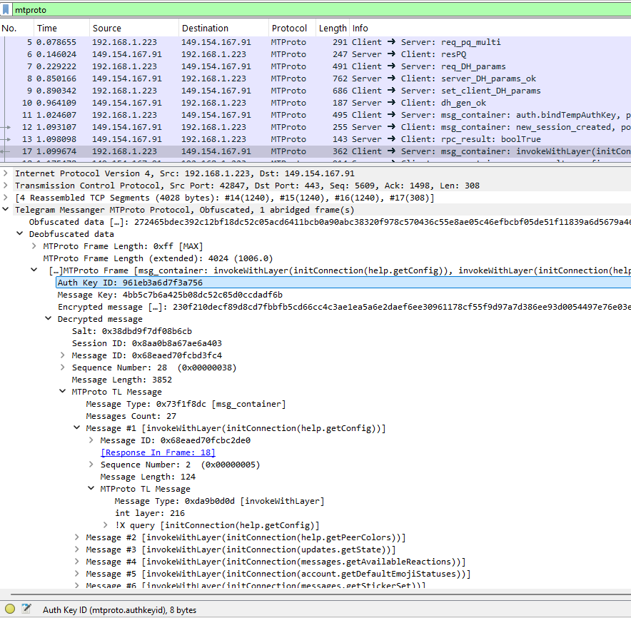

# Telegram Protocol Dissector

This is a Wireshark dissector that helps you understand the Telegram traffic around you.

It dissects the Telegram packets it sees according to the [MTProto 2.0 Protocol](https://core.telegram.org/mtproto/description).




### Features
- Supported [transport protocols](https://core.telegram.org/mtproto/mtproto-transports): Abridged, Full, Intermediate, HTTP
- Supports de-obfuscation
- Supports decryption (with given auth key)
- Dissects [TL language](https://core.telegram.org/mtproto/TL) RPC payloads

### Limitations
- Supports MTProto 2.0 only (so not for clients older than 2017)
- Does not yet support WebSocket/[Padded intermediate](https://core.telegram.org/mtproto/mtproto-transports#padded-intermediate)/UDP transport protocols
- [TL language](https://core.telegram.org/mtproto/TL) is is not 100% parsed, e.g. Associative Arrays are not supported
- Does not yet automatically detect MTProxy traffic, or traffic for uncofficial MTProto servers

## Installation and usage

To install this dissector:

1. Install the [luagcrypt](https://github.com/Lekensteyn/luagcrypt) lua bindings that are needed for cryptographic operations. 
    - Possible to compile it with `luarocks` (for your Wireshark's Lua version)
    - Windows users can look in [this issue](https://github.com/Lekensteyn/luagcrypt/issues/4) for a pre-compiled `luagcrypt.dll`
    - Copy the matching `luagcrypt.dll`/`luagcrypt.so` to the Wireshark install directory, for example `C:\Program Files\Wireshark`
2. Clone or download this repository
3. Copy the `mtproto` directory to the Wireshark plugins directory, for example `C:\Users\<username>\AppData\Roaming\Wireshark\plugins`

After installation, you can just open Wireshark with some Telegram traffic. 

**IMPORTANT**: For the de-obfuscation to work, the entire TCP conversation must be known from the beginning (per the MTProto specs), so it's recommended to open the Telegram app *after* the recording of packets starts.

## Auth key extraction
To decrypt the traffic, you'll need to have the matching [Authorization Key (auth_key)](https://core.telegram.org/method/auth.bindTempAuthKey).

Recent versions of official Telegram clients use [Perfect Forward Secrecy](https://core.telegram.org/api/pfs) for cloud chats, by calling [auth.bindTempAuthKey](https://core.telegram.org/method/auth.bindTempAuthKey) on startup and\or on a regular basis. This means that main sessions will use temporary auth keys ([established using DH](https://core.telegram.org/mtproto/auth_key)) rather than permanent ones.

To extract the used auth keys on the fly, two [frida](https://frida.re/) scripts are provided that hook the Telegram processes.
To use them, make sure you have [Frida installed](https://frida.re/docs/installation/), and run:
- `hook_windows_auth_key.py` for the official Windows app (with some changes could probably work on Linux\Mac too)
- `hook_android_auth_key.py` for the official Android app

Auth keys and auth key IDs should be printed as soon as some network communication is done. 

Once you have your auth keys, to feed the dissector with them go to Edit --> Prefrences --> Protocols --> MTProto and fill the auth keys.

You can also extract the permanent auth key from the `tgnet.dat` file (Android - see for example [here](https://github.com/DrKLO/Telegram/blob/702d37ce69fca77e78072ad408e9d29dfd2d2be8/TMessagesProj/jni/tgnet/ConnectionsManager.cpp#L364), [here](https://github.com/DrKLO/Telegram/blob/fff7c8d97f5ca5708a1252ed58a6bb526de6e08e/TMessagesProj/jni/tgnet/Datacenter.cpp#L46), [here](https://github.com/tsusanka/telegram-extractor)) or from the `key_datas` file (Desktop - look [here](https://github.com/telegramdesktop/tdesktop/blob/beb4fafdf3955a5989a41540ca391451e6647845/Telegram/SourceFiles/storage/storage_domain.cpp#L139), [here](https://github.com/openwall/john/blob/bleeding-jumbo/run/telegram2john.py)). Other clients probably store the auth_key in a different way.

## API level sync

Sometimes, Telegram updates the [API schema version](https://core.telegram.org/api/invoking#layers) in its clients (or perhaps you are looking at traffic from older clients). When this happens, it's possible that this tool's TL schema will be out of sync with some of the RPC calls you see in your packets, raising `Incomplete parsing` messages in Wireshark. You can see which API level your app is using in its [invokeWithLayer](https://core.telegram.org/method/invokeWithLayer) request.

To sync the dissector with the correct API schema, you'll need to download the layer's TL file from Telegram, convert it to JSON (see below) and save it under `mtproto/schema/api_tl_schema_layer_X.json` where X is your layer number.

You can get the updated API TL schema from [the desktop app's api.tl](https://github.com/telegramdesktop/tdesktop/commits/dev/Telegram/SourceFiles/mtproto/scheme/api.tl), or look [in the Telegram website](https://core.telegram.org/schema) for more versions.

To convert the `tl` file to JSON, run, e.g (make sure you have `npm` installed)
```
C:\path\to\MTproto Dissector> 
npx @psqq/tl-to-json api_layer_218.tl mtproto/schema/api_tl_schema_layer_218.json default --indent 4
```

Then make sure you copy the new json file to `mtproto/schema/` in Wireshark's plugins directory.
Finally, in Wireshark go to Edit --> Prefrences --> Protocols --> MTPROTO, and change "API level" to the level that matches your traffic.